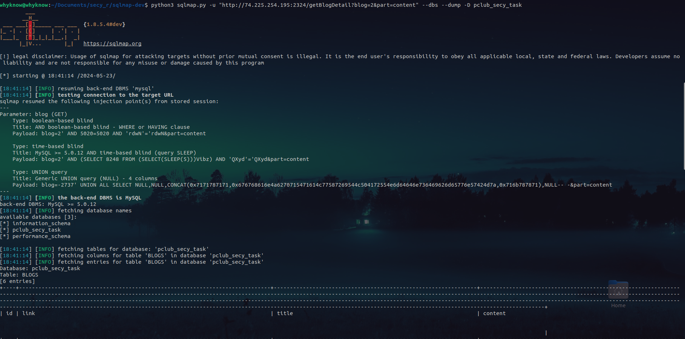
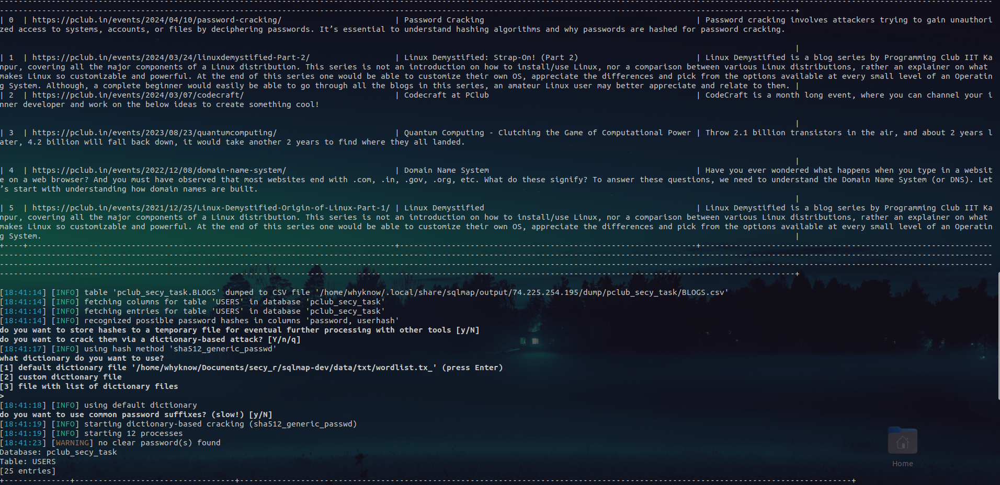
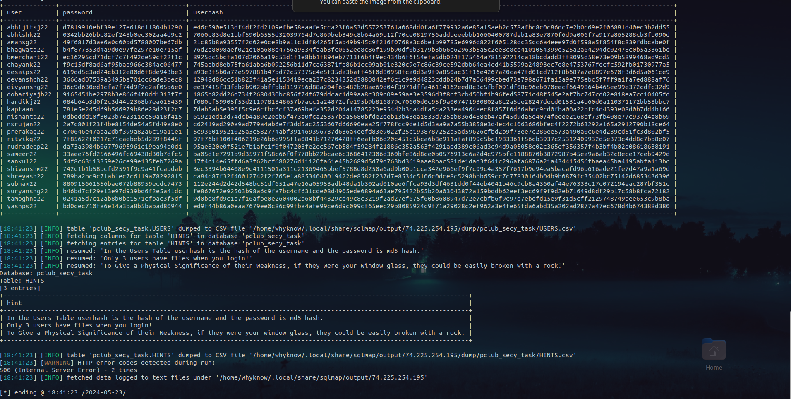

# PClub DVWA

### Flag 1: pclub{path_trav3rsa1_1s_fun}

#### Writeup:

I tried going through different endpoints of the site, then ended up opening one of the images url present in the gallery and got this http://74.225.254.195:2324/getFile?file=/home/kaptaan/PClub-DVWA/static/images/gallery/3.jpeg in which then i changed the file location to routes.txt as it was hinted in the question and got the first flag along with various end points. The content of routes.txt was / /gallery /blogs /ipDetails /secretary_login /recovery /robots.txt /getFileList /getFile /download /getBlogDetail pclub{path_trav3rsa1_1s_fun} Can you now get me the MAC Address of eth0 interface for this machine for me??? Using command injection ;). This also gave me the hint for second flag.

### Flag 2: eth0 mac address is 60:45:bd:af:3f:e5

#### Writeup:

As it stated in the routes.txt, now I have to use command injection to get the MAC address of the machine. I started exploring the end points in routes.txt and checking which one is vulnerable to command injection. As I got to the /ipDetails that opened a webpade which asked for a ip address and returned what type of ip address it is. I sensed that this could be vulnerable to command injection and started using different commands to check it. As I entered the ip Address and a basic shell command pwd with a semicolon in between i.e. 127.0.0.1 ; pwd (command injection) I got <br>
[+]message '127.0.0.1' is a bogon (Loopback [RFC1122], Section 3.2.1.3) IP address.

/home/kaptaan/PClub-DVWA<br>
as an output. Hence http://74.225.254.195:2324/ipDetails is vulnerable to command injection. To get the mac address I replaced pwd with ipconfig and got the eth0 interface MAC address of the machine.

### Flag 3: pclub{01d_1s_g01d_sql1}

#### Writeup:

As there was no hint for the third flag, I again started checkig all the end points. When I arrived at the getBlogDetail and on the blogs page sent a request , i got responses like this in return http://74.225.254.195:2324/getBlogDetail?blog=2&part=title
that is it leads me to getBlogDetails endpoint with parameteres blog and title. After seeing this I thought of sql injection and tried fidgeting with it. I first used the commomn payloads available on the git repo https://github.com/payloadbox/sql-injection-payload-list.git but got nothing and then decided to use sqlmap , the installation and usage of sqlmap is given in this git repo https://github.com/sqlmapproject/sqlmap.git , using this I got to know the vulnerable parameter is blog , i tried checking the payloads manually and again got nothing, then i again used sqlmap to extract the databases and found something intresting , 3 databases <br>
available databases [3]:<br>
information_schema<br>
pclub_secy_task<br>
performance_schema<br>
then I dumped the pclub_secy_task database and got 3 hints along with a table which had the secys usernames abd md5 hashed passwords. Then I went to the secretary login page first i used the username kaptaan and used a md5 decrypter online to get the password 0123456789 and got the third flag in the form of flag.txt.<br>
The command I used to get the database is :-

```bash
  python3 sqlmap.py -u "http://74.225.254.195:2324/getBlogDetail?blog=2&part=content" --dbs
```

And the command I used to dump database is

```bash
  python3 sqlmap.py -u "http://74.225.254.195:2324/getBlogDetail?blog=2&part=content" --dbs --dump -D pclub_secy_task
```





### Flag 4: pclub{data_1s_3v3ryth1ng}

#### Writeup:

For the 4th flag, when I performed sql injection i got 3 hints which stated:<br>
In the Users Table userhash is the hash of the username and the password is md5 hash.<br>
Only 3 users have files when you login!<br>
To Give a Physical Significance of their Weakness, if they were your window glass, they could be easily broken with a rock. <br>
I already got the third flag from user kaptaan, now there were two more users which have files in them but decrypting all md5 hasher could be tough so when I logged in using kaptaan i saw what response I am getting in the developers tool of the website
and got this http://74.225.254.195:2324/getFileList?user=kaptaan so I started changing user parameter one by one and at amansg22 and got an image,I downloaded it by again changing the file parameter to amansg22/ariitk.jpeg in the response I got during downloading flag.txt i.e. http://74.225.254.195:2324/download?file=kaptaan/flag.txt and then at user ritvikg22 I got a txt file named pwn_chall_link.txt. I opened the image which was named ariitk.jpeg .<br>

Then I started using common steg tools like strings, exiftool, binwalk, etc. Finally using steghide I found a qr_code.png. Then scanned the qr and got a base64 encoded string Y3B5aG97cW5nbl8xZl8zaTNlbGd1MWF0fQ== which looked like a ceaser cipher message so using an ceaser cipher decoder I got the fourth flag.
The command I used to get the qr_code.png is

```bash
  steghide extract -sf ariitk.jpeg
```
qr code:


<br><br><br>
Note :- For the fifth flag I first checked the contents of the txt file which had a pastebin link which consisted of a drive link having a file named whathash<br>
whathash: ELF 32-bit LSB pie executable, Intel 80386, version 1 (SYSV), dynamically linked, interpreter /lib/ld-linux.so.2, BuildID[sha1]=c8a38a0f54a1d51afdbc8e274d49333a523143f9, for GNU/Linux 4.4.0, not stripped. <br>
The txt file also had the server which would give the flag and some information about SHA1 and a youtube video of some music.<br>
I tried using tools like objdump, strace, ltrace, checksec, ghidra, gdb and others which could help me in reverse engineering.
